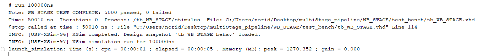
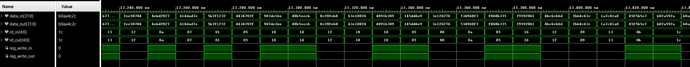

# WB_STAGE

## Overview
This project implements the Write Back (WB) Stage of a 5-stage pipelined RISC-V CPU in VHDL. The WB stage receives the final 32-bit result selected by the MEM stage—either the ALU result, the loaded memory value, or zero—and passes it to the register file. It does not make any decisions; it simply forwards the input to the decoder stage for register write-back. A randomized testbench was used to validate that the input to the WB stage matches the output, confirming correct data propagation.
This stage was designed, implemented, and validated as part of my hands-on learning in pipelined CPU architecture.
---
## Features
- Receives 32-bit result from MEM stage (ALU result, memory load, or zero)
- Forwards result directly to register file for write-back
- Pass-through design: no internal decision logic
- Includes rd and reg_write forwarding for final register update
- Verified with randomized testbench for input-output consistency
- Designed to integrate cleanly into 5-stage pipelined RISC-V CPU
---
## Project Structure
**MEM_STAGE**/
- images/
    - tcl.png, wave.png
- src/
    - WB_STAGE.vhd, reusable_function.vhd, reusable_func_def.vhd
- test_benches/
    - tb_WB_STAGE.vhd
- .gitignore
- README.md
---
## 🧪 Testbench Strategy
- Uses `uniform()` from `math_real` to generate randomized value for the pass through signal.
- Wrote an assertion if what comes in comes out
- Keep track of pass or fail test
- Organized the signal to match what comes in comes out 

## 📊 Simulation Results

### Tcl Console Output
  
*5000 tests passed.*

### Waveform: Memory Read and Memory Write
 
*The wave shows that what comes in comes out* 
---
## 💡 Key Learnings
- Learned how to organized signals for wave debugging
---

## ▶️ How to Run

1. Launch **Vivado 2019.2** or later
2. Create or open a project and add:
    - `src/*.vhd` (design files)
    - `test_benches/tb_MEM_STAGE.vhd`
3. Set `tb_MEM_STAGE.vhd` as the simulation top module
4. Run Behavioral Simulation:
    - *Flow > Run Simulation > Run Behavioral Simulation*
5. Increase simulation time if needed
6. Observe:
    - Console output (for pass/fail)
    - Waveform viewer (for data, control, and glitch inspection)
---

## 👤 Author
**Noridel Herron**  
Senior in Computer Engineering – University of Missouri  
✉️ noridel.herron@gmail.com  
GitHub: [@NoridelHerron](https://github.com/NoridelHerron)

---

## 🤝 Contributing
This is a personal academic project. Feedback and suggestions are welcome via GitHub issues or pull requests.

---

## 📜 License
MIT License

---

## ⚠️ Disclaimer
This project is for **educational use only**. Some components may be experimental and are not intended for production use.
